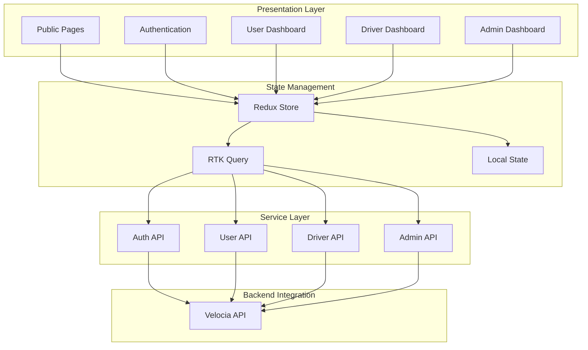

<div align="center">
  
</div>

<div align="center">
  <h2>
    
    Enterprise Grade Ride Sharing Application
  </h2>
  <p><strong>Built with precision, designed for excellence</strong></p>
  <p><strong>Velocia Frontend</strong> is a production-ready, high-performance web application for modern ride-sharing platforms. Built with cutting-edge technologies and best practices, it provides an intuitive, responsive, and feature-rich user experience across all devices.</p>
</div>

<div align="center">
    
  [](https://github.com/zahid-official/velocia-frontend)
  [](https://react.dev)
  [](https://www.typescriptlang.org/)
  [](https://vitejs.dev/)
  [](https://tailwindcss.com/)
</div>

<div align="center">
    
  [](https://vercel.com)
  [](https://redux-toolkit.js.org/)
  [](LICENSE)
  [](https://github.com/zahid-official/velocia-frontend/pulls)
</div>

## ✨ Features

<table align="center">
  <tr>
    <td width="50%">
      
### 🔐 Authentication & User Management
- **Secure Authentication** with JWT tokens
- **Role-based Dashboards** for riders, drivers, and admins
- **Profile Management** with avatar upload
- **Password Management** with reset functionality
- **OTP Verification** for account security
- **Social Authentication** ready architecture
      
### 🚗 Ride Management
- **Real-time Ride Requests** with live tracking
- **Interactive Map Integration** for location selection
- **Ride History** with detailed records
- **Active Ride Monitoring** with emergency features
- **Driver Matching** algorithm visualization
- **Fare Calculation** and display
      
    </td>
    <td width="50%">
      
### 👨‍💼 Multi-Role Support
- **Admin Dashboard** with analytics
- **Driver Portal** for ride management
- **Rider Interface** for booking rides
- **User Management** for admins
- **Earnings Tracking** for drivers
- **Verification Workflows** for driver applications
      
### 🎨 Modern UI/UX
- **Responsive Design** across all devices
- **Dark/Light Mode** theme support
- **Smooth Animations** and transitions
- **Accessible Components** with ARIA support
- **Interactive Charts** and data visualization
- **Toast Notifications** for user feedback
      
    </td>
  </tr>
</table>
</br>

## 🗺️ Application Architecture



<div align="center">
    
| Design Principle | Description |
|------------------|-------------|
| **🎯 Component-Based** | Modular, reusable components for scalability |
| **📱 Mobile-First** | Responsive design prioritizing mobile experience |
| **⚡ Performance-Optimized** | Code splitting, lazy loading, and optimization |
| **♿ Accessibility-First** | WCAG compliant with full keyboard navigation |
| **🎨 Theme Support** | Dark/light mode with system preference detection |
</div>

## 🛠️ **Tech Stack**

<div align="center">
    
### **Core Technologies**
<table>
  <tr>
    <td align="center" width="120">
      
      <br />React
    </td>
    <td align="center" width="120">
      
      <br />TypeScript
    </td>
    <td align="center" width="100">
      
      <br />Vite
    </td>
    <td align="center" width="100">
      
      <br />Tailwind CSS
    </td>
    <td align="center" width="100">
      
      <br />Redux Toolkit
    </td>
    <td align="center" width="120">
      
      <br />Vercel
    </td>
  </tr>
</table>

### **Additional Stack**

| Category                  | Technologies                | Purpose                      |
| :------------------------ | :-------------------------- | :--------------------------- |
| 🎨 **UI Components**      | `shadcn/ui` `Origin UI`     | Accessible component library |
| 📊 **Data Visualization** | `Shadcn Charts`             | Charts and analytics         |
| 🗺️ **Maps & Location**    | `nominatim.openstreetmap`   | Interactive maps             |
| 🔄 **State Management**   | `Redux Toolkit` `RTK Query` | Global state and API caching |
| 📝 **Form Management**    | `React Hook Form` `Zod`     | Form handling and validation |
| 🎭 **Icons**              | `Lucide React`              | Modern icon library          |
| 🚀 **Deployment**         | `Vercel`                    | Cloud deployment             |

</div>
</br>

## 🚀 **Getting Started**

### **⚡ Quick Installation**

```bash
# 1. Clone the repository
git clone https://github.com/zahid-official/milestone-17-client.git
cd milestone-17-client

# 2. Install dependencies
pnpm install
# or
npm install

# 3. Set up environment variables
cp .env.example .env
# Edit .env with your configuration

# 4. Start development server
pnpm dev
# or
npm run dev

# 5. Access the application
# http://localhost:5173
```

### **📦 Prerequisites**

- Node.js 18.x or higher
- pnpm 8.x (recommended) or npm 9.x
- Git
- Modern web browser

### **🔧 Environment Configuration**

<details>
<summary><b>Click to view essential .env variables</b></summary>

```env
# API Configuration
VITE_API_BASE_URL=http://localhost:5000/api/v1
# OR Production
# VITE_API_BASE_URL=https://velocia-api.vercel.app/api/v1

# Map Configuration (Optional)
VITE_MAPBOX_TOKEN=your-mapbox-token
VITE_GOOGLE_MAPS_KEY=your-google-maps-key
```

</details>

---

## 📁 **Project Structure**

<details>
<summary><b>Click to view project folder structure</b></summary>

```
velocia-frontend/
├── 📄 Configuration Files
│   ├── vite.config.ts              # Vite configuration
│   ├── tsconfig.json               # TypeScript configuration
│   ├── tailwind.config.js          # Tailwind CSS configuration
│   ├── components.json             # shadcn/ui configuration
│   └── vercel.json                 # Vercel deployment config
│
├── 📁 public/                      # Static assets
│   ├── icons/                      # Application icons
│   └── images/                     # Public images
│
└── 📁 src/
    ├── 📄 App.tsx                  # Root component
    ├── 📄 main.tsx                 # Application entry point
    ├── 📄 global.css               # Global styles
    │
    ├── 📁 config/                  # Configuration
    │   └── env.ts                  # Environment variables
    │
    ├── 📁 constants/               # Application constants
    │   ├── accountStatus.ts        # Account status enums
    │   ├── availability.ts         # Driver availability
    │   ├── rideStatus.ts          # Ride status enums
    │   └── role.ts                # User role enums
    │
    ├── 📁 context/                 # React contexts
    │   └── Theme.context.ts       # Theme context
    │
    ├── 📁 hooks/                   # Custom React hooks
    │   ├── use-file-upload.ts     # File upload hook
    │   ├── use-mobile.ts          # Mobile detection
    │   ├── use-pagination.ts      # Pagination logic
    │   ├── useDebounce.ts         # Debounce hook
    │   └── useTheme.ts            # Theme management
    │
    ├── 📁 lib/                     # Utilities
    │   ├── axios.ts               # Axios configuration
    │   └── utils.ts               # Helper functions
    │
    ├── 📁 providers/               # Context providers
    │   └── theme.provider.tsx     # Theme provider
    │
    ├── 📁 redux/                   # State management
    │   ├── store.ts               # Redux store
    │   ├── hooks.ts               # Typed Redux hooks
    │   ├── baseApi.ts             # RTK Query base
    │   ├── axiosBaseQuery.ts      # Custom base query
    │   └── features/              # Feature slices
    │       ├── auth/              # Authentication
    │       ├── user/              # User management
    │       ├── driver/            # Driver operations
    │       └── admin/             # Admin features
    │
    ├── 📁 routes/                  # Routing configuration
    │   ├── index.tsx              # Main routes
    │   ├── admin/                 # Admin routes
    │   ├── driver/                # Driver routes
    │   └── user/                  # User routes
    │
    ├── 📁 types/                   # TypeScript types
    │   ├── auth.types.ts          # Auth types
    │   ├── driver.types.ts        # Driver types
    │   ├── user.types.ts          # User types
    │   └── index.ts               # Barrel exports
    │
    ├── 📁 utils/                   # Utility functions
    │   ├── generateRoutes.ts      # Route generation
    │   ├── generateSidebar.ts     # Sidebar generation
    │   ├── geo.ts                 # Geolocation utilities
    │   └── withAuth.tsx           # Auth HOC
    │
    ├── 📁 components/
    │   ├── 📁 layout/             # Layout components
    │   │   ├── CommonLayout.tsx   # Public layout
    │   │   ├── DashboardLayout.tsx # Dashboard layout
    │   │   ├── Footer.tsx         # Footer component
    │   │   ├── Navbar.tsx         # Navigation bar
    │   │   └── ThemeToggler.tsx   # Theme switcher
    │   │
    │   ├── 📁 ui/                 # UI components (shadcn/ui)
    │   │   ├── button.tsx         # Button component
    │   │   ├── input.tsx          # Input component
    │   │   ├── card.tsx           # Card component
    │   │   ├── dialog.tsx         # Modal dialogs
    │   │   ├── table.tsx          # Table component
    │   │   ├── chart.tsx          # Chart components
    │   │   └── ...                # Other UI components
    │   │
    │   └── 📁 modules/            # Feature modules
    │       ├── authentication/    # Auth forms
    │       ├── Public/           # Public pages
    │       ├── user/             # User features
    │       └── driver/           # Driver features
    │
    └── 📁 pages/                  # Page components
        ├── admin/                 # Admin pages
        ├── driver/               # Driver pages
        ├── user/                 # User pages
        └── public/               # Public pages
```

</details>

---

## 🎨 **Key Features**

### **Authentication System**

- Secure JWT-based authentication
- Role-based access control (Admin, Driver, Rider)
- Protected routes with automatic redirection
- Persistent login with refresh tokens
- OTP verification for account security

### **Dashboard Interfaces**

#### **Rider Dashboard**

- Quick ride request form with location autocomplete
- Real-time ride tracking with map visualization
- Ride history with detailed records
- Profile management with avatar upload
- Emergency contacts management

#### **Driver Dashboard**

- Availability toggle for online/offline status
- Incoming ride requests with accept/reject actions
- Current ride management with status updates
- Earnings tracker with detailed breakdown
- Vehicle information management
- Ride history and statistics

#### **Admin Dashboard**

- Comprehensive analytics with interactive charts
- User management with block/unblock capabilities
- Driver verification and approval workflow
- Ride oversight with detailed monitoring
- Platform statistics and metrics

### **Real-time Features**

- Live ride status updates
- Driver location tracking
- Instant notifications
- Real-time availability changes

### **Responsive Design**

- Mobile-first approach
- Tablet and desktop optimizations
- Touch-friendly interactions
- Adaptive layouts

---

## 🔐 **Authentication & Authorization**

### **Login Credentials for Testing**

<details>
<summary><b>Click to view login credentials</b></summary>

```plaintext
Admin Account:
Email: default@email.com
Password: default@Admin123

Driver Account:
Email: driver@email.com
Password: default@Admin123

Rider Account:
Email: rider@email.com
Password: default@Admin123
```

</details>

### **Protected Routes**

Routes are protected based on user roles:

- `/admin/*` - Admin only
- `/driver/*` - Drivers only
- `/user/*` - Riders only

Unauthorized access attempts redirect to appropriate pages.

### **Routing Structure**

<details>
<summary><b>Click to view endpoints</b></summary>

### **Public Routes** (No Authentication Required)

```typescript
/                    → Home page
/about              → About us
/features           → Platform features
/faq                → Frequently asked questions
/contact            → Contact form
/login              → Login page
/register           → Registration (Rider/Driver)
/verify             → OTP verification
```

### **Protected Routes** (Authentication Required)

#### **Rider Routes** (`/user/*`)

```typescript
/user/ride-request     → Request a new ride
/user/active-ride      → Current active ride
/user/ride-history     → Past rides with filters
/user/profile          → Profile management
/user/change-password  → Password update
/user/emergency        → Emergency contacts
```

#### **Driver Routes** (`/driver/*`)

```typescript
/driver/availability      → Toggle online/offline
/driver/requests          → Incoming ride requests
/driver/current-ride      → Active ride management
/driver/earnings          → Earnings dashboard
/driver/history           → Completed rides
/driver/vehicle-info      → Vehicle details
```

#### **Admin Routes** (`/admin/*`)

```typescript
/admin/analytics         → Platform analytics
/admin/users             → User management
/admin/drivers           → Driver management
/admin/rides             → All rides oversight
```

</details>

---

## 📊 **State Management**

### **Redux Store Structure**

```typescript
{
  auth: {
    user: User | null,
    token: string | null,
    isAuthenticated: boolean
  },
  api: {
    queries: {...},
    mutations: {...}
  }
}
```

### **RTK Query API's**

- **authApi**: Authentication operations
- **userApi**: User management
- **driverApi**: Driver operations
- **adminApi**: Admin features

---

## 🎨 **Styling & Theming**

### **Theme System**

- Dark and light mode support
- System preference detection
- Persistent theme selection
- Smooth theme transitions

### **Color Palette**

```css
/* Light Mode */
--primary: 222.2 47.4% 11.2%
--secondary: 210 40% 96.1%
--accent: 210 40% 96.1%

/* Dark Mode */
--primary: 210 40% 98%
--secondary: 217.2 32.6% 17.5%
--accent: 217.2 32.6% 17.5%
```

### **Responsive Breakpoints**

```typescript
sm: '640px'   // Mobile
md: '768px'   // Tablet
lg: '1024px'  // Desktop
xl: '1280px'  // Large Desktop
2xl: '1536px' // Extra Large
```

---

## 🚀 **Build & Deployment**

### **Development**

```bash
pnpm dev          # Start dev server
pnpm build        # Build for production
pnpm preview      # Preview production build
pnpm lint         # Run ESLint
```

### **Production Build**

```bash
# Build optimized production bundle
pnpm build

# Output directory: dist/
# The build is minified and optimized for performance
```

### **Deploy to Vercel**

<div>

[](https://vercel.com/new/clone?repository-url=https://github.com/zahid-official/velocia-frontend)

</div>

#### **Manual Deployment**

```bash
# Install Vercel CLI
npm i -g vercel

# Deploy
vercel

# Set environment variables in Vercel dashboard
# or via CLI
vercel env add VITE_API_BASE_URL

# Deploy to production
vercel --prod
```

#### **Environment Variables in Vercel**

Add these in your Vercel dashboard:

- `VITE_API_BASE_URL`
- `VITE_MAPBOX_TOKEN` (optional)
- `VITE_GOOGLE_MAPS_KEY` (optional)

---

## 📱 **Browser Support**

| Browser | Version         |
| ------- | --------------- |
| Chrome  | Last 2 versions |
| Firefox | Last 2 versions |
| Safari  | Last 2 versions |
| Edge    | Last 2 versions |

---

## 🔄 **API Integration**

The frontend integrates with the Velocia Backend API. See the [Backend Documentation](https://github.com/zahid-official/milestone-17-server) for API details.

### **Base URL Configuration**

```typescript
// Development
const API_URL = "http://localhost:5000/api/v1";

// Production
const API_URL = "https://velocia-api.vercel.app/api/v1";
```

---

## 🌟 **Author**

<div align="center">
  <a href="https://github.com/zahid-official">
    
  </a>
  
  <h3>Zahid Official</h3>
  <p><b>Web Developer | Tech Enthusiast</b></p>
  
  [](https://github.com/zahid-official)
  [](https://linkedin.com/in/zahid-web)
  [](mailto:zahid.official8@gmail.com)
  
  <p>Built with passion and dedication to create scalable solutions</p>
</div>

---

## 🤝 **Contributing**

Contributions make the open source community amazing! Any contributions you make are **greatly appreciated**.

```bash
1. Fork the Project
2. Create your Feature Branch (git checkout -b feature/AmazingFeature)
3. Commit your Changes (git commit -m 'Add some AmazingFeature')
4. Push to the Branch (git push origin feature/AmazingFeature)
5. Open a Pull Request
```

</br>

<div align="center">
  
Distributed under the **MIT License**. See [`LICENSE`](LICENSE) for more information.

</div>
